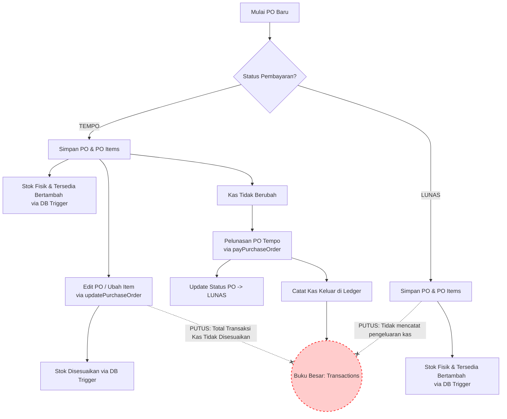
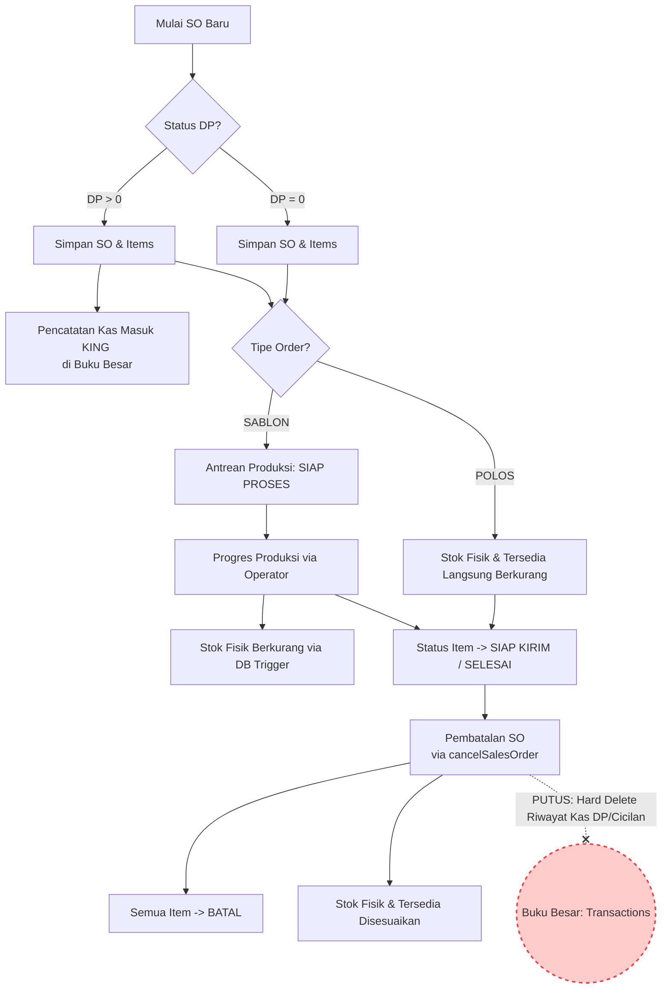
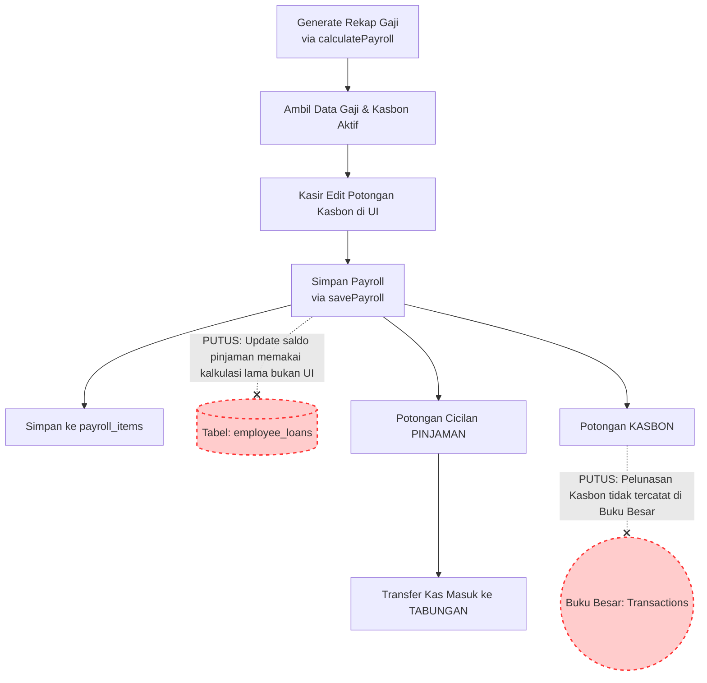

# Diagram Alur Data ERP King Sablon Cup

Dokumen ini memetakan alur data utama dalam ERP King Sablon Cup dan mengidentifikasi bagian-bagian alur data yang terputus (broken data flows) berdasarkan audit kode server actions, database triggers, dan file audit sistem.

---

## 1. Alur Transaksi Pembelian (Purchase Order) & Buku Besar
Diagram ini menunjukkan alur data ketika transaksi pembelian (PO) dibuat, diedit, atau dilunasi. Jalur merah/putus-putus menggambarkan hilangnya pencatatan pengeluaran kas di Buku Besar (`transactions`).

### Penjelasan Celah Alur PO:
1. **Lunas Tanpa Buku Besar**: Server action `createPurchaseOrder` tidak memiliki logika untuk memasukkan record pengeluaran kas (`amount_out`) saat PO dibuat langsung sebagai `LUNAS`. Buku Besar hanya terisi jika PO dibuat sebagai `TEMPO` terlebih dahulu lalu dilunasi melalui `payPurchaseOrder`.
2. **Inkonsistensi Edit PO**: Fungsi `updatePurchaseOrder` membolehkan user mengubah kuantitas atau nominal item PO yang mengubah total biaya. Namun, transaksi kas keluar yang sudah ada di tabel `transactions` tidak ikut terupdate atau disesuaikan.

---

## 2. Alur Transaksi Penjualan (Sales Order) & Pembatalan Kas
Diagram ini menunjukkan siklus pesanan penjualan hingga pembatalan. Jalur merah/putus-putus menyoroti masalah *wiping history* (penghapusan data kas secara permanen) saat pesanan dibatalkan.

### Penjelasan Celah Alur SO:
1. **Penghapusan Kas Masuk (Wiping Kas)**: Saat pesanan dibatalkan melalui `cancelSalesOrder`, sistem menghapus permanen (`delete`) seluruh log pembayaran DP dan cicilan dari tabel `transactions`. Secara bisnis, uang DP yang telah masuk ke kasir fisik tidak hilang/dikembalikan otomatis, sehingga penghapusan log digital ini membuat neraca kas sistem dan kas fisik di laci tidak cocok.

---

## 3. Alur Potongan Pinjaman, Penggajian & Buku Besar
Diagram ini memetakan alur potongan gaji karyawan untuk melunasi kasbon/pinjaman, serta mencatat pengeluaran kas di Buku Besar. Jalur merah/putus-putus menunjukkan masalah sinkronisasi UI-ke-DB dan hilangnya histori kas masuk pelunasan kasbon.

### Penjelasan Celah Alur Payroll & Loan:
1. **UI vs DB Mismatch**: Di antarmuka penggajian, kasir dapat mengubah jumlah potongan kasbon secara manual. Namun, server action `savePayroll` memproses pemotongan saldo pinjaman di tabel `employee_loans` menggunakan data kalkulasi awal (`loanDeductions`), bukan nominal hasil modifikasi manual kasir di UI. Hal ini menyebabkan sisa saldo utang di database tidak sinkron dengan nominal bersih yang diterima karyawan.
2. **Pelunasan Kasbon Tanpa Catatan Ledger**: Saat Kasbon dipotong dari gaji, status kasbon berubah menjadi `LUNAS` di tabel `employee_loans`. Namun, sistem tidak menambahkan baris pencatatan kas masuk penyeimbang ke Buku Besar (`transactions`) untuk mendokumentasikan bahwa kasbon tersebut telah dilunasi/dikembalikan.
